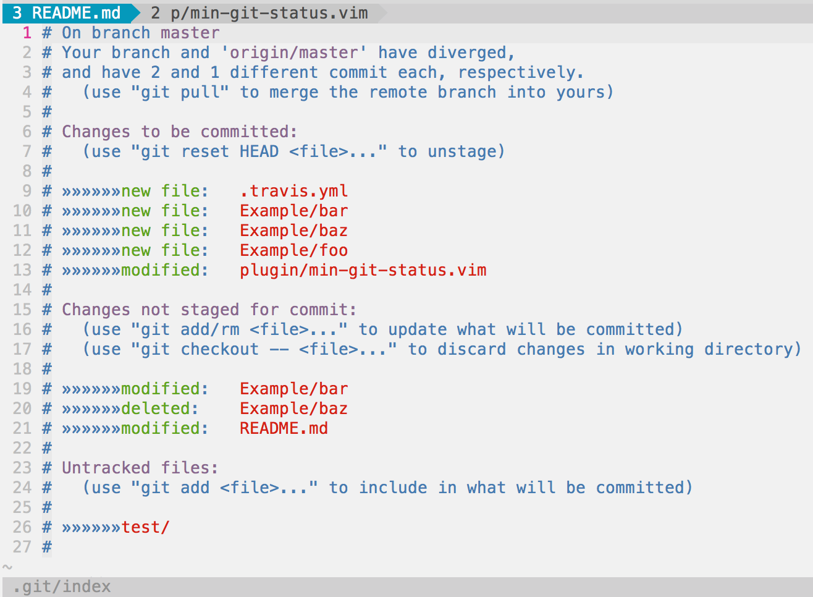

vim-min-git-status 
==================

A minimal replacement for fugitive's Gstatus command. Uses `git status --short` to render status which keeps things concise and clean.

## What are the advantages over Gstatus?
* **Space conscious** (See screenshots below)
  - Same information conveyed in fewer lines
  - Status window automatically resizes to fit its content
* **More file shortcuts**
  - Press `t` on a file to open it in a new tab
  - Press `v` on a file to open it in a new vertical split
  - Press `s` on a file to open it in a new horizontal split
* **Files don't move or re-order themselves when staging / unstaging**
  - Files always remain in alphabetical order instead of being grouped by their status in the git index

## Installation
* **Installation with [Vundle](https://github.com/gmarik/Vundle.vim)**
  - Add `Bundle 'alexdavid/vim-min-git-status'` to your vimrc
  - run `vim +BundleInstall!`

* **Installation with [Pathogen](https://github.com/tpope/vim-pathogen)**
  - `git clone git://github.com/alexdavid/vim-min-git-status.git ~/.vim/bundle`

## Screenshots
| **Gstatus**                 |**Gministatus**                       |
|-----------------------------|--------------------------------------|
|  |  |

## Usage
Open the status window with `:Gministatus`, then position cursor over files and type:
* `-` to Stage/unstage files
  * Note: If there are changes in the index *and* working tree this will stage the file
* `.` to get the file path in vim's command line
* `o` or `Enter` to open the file
* `t` to open the file in a new tab
* `v` to open the file in a new vertical split
* `s` to open the file in a new horizontal split
* `p` to `add --patch` or `reset --patch` the file
  * Note: If there are changes in the index *and* working tree this will `add --patch`
* `git` to get the file path in vim's command line prefixed by `!git`.
  * Your cursor will be between `!git` and the file path.
  * For example, to checkout a file, you can position your cursor over a changed file and just type `git` then `checkout<Enter>`
* `r` or `R` to refresh
* `cc` to commit
* `q` to quit
